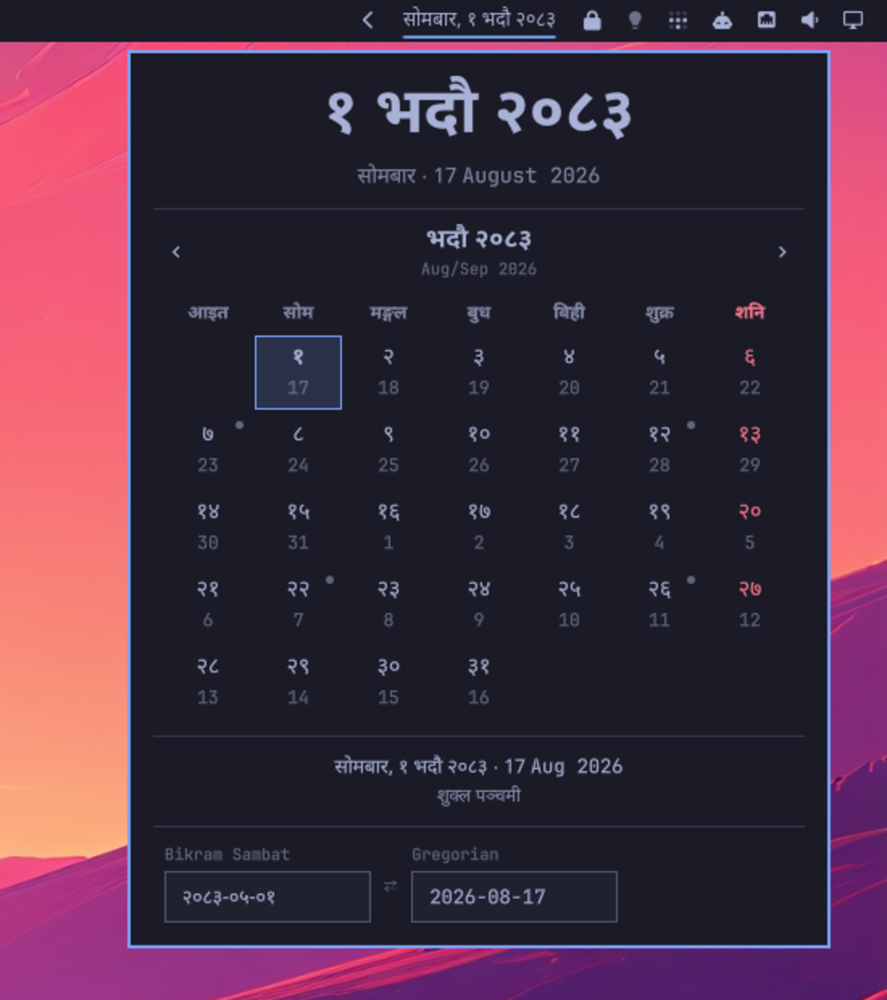

# Patro

Nepali calendar for the [Omarchy](https://omarchy.org/) bar. Bikram Sambat date,
month view in Devanagari, tithi, holidays, and a BS ↔ AD converter.



## Install

```bash
omarchy plugin add https://github.com/nativeanish/patro.git --enable
```

Devanagari comes from `noto-fonts`, already installed by Omarchy.

Optional keybind, in `~/.config/hypr/bindings.conf`:

```
bindd = SUPER SHIFT, C, Patro, exec, omarchy-shell io.github.nativeanish.patro toggle
```

## Keys

| Key | |
|---|---|
| `←` `→` | day |
| `↑` `↓` | week |
| `[` `]` or `h` `l` | month |
| `{` `}` or `k` `j` | year |
| `t` | today |
| `b` / `a` | switch BS / AD mode |
| `Enter` | copy the selected date |
| `Esc` | close |

Bar: left click opens the month view, right click cycles the label format,
middle click copies today's date.

## Features

- **Titlebar time & date**: shows time, Nepali weekday, BS date, and Gregorian date (e.g. `15:02 | शनिबार | २० भदौ | 5 September`).
- **BS / AD Switcher**: toggle between Bikram Sambat and Gregorian calendars with dual date display.
- **Year Progress**: visual progress bar with remaining days in both BS and AD years.

## Settings

`Setup > Plugins`.

| | | Default |
|---|---|---|
| Language | Nepali, English | Nepali |
| Numerals | Devanagari, Latin | Devanagari |
| Bar format | Time and Date, Full, Compact, Numeric, With Gregorian | Time and Date |
| Show weekday | | on |
| Week starts on | Sunday, Monday | Sunday |
| Show Gregorian dates | | on |
| Show tithi | | on |
| Font family | empty inherits the bar font | empty |

Saturdays and public holidays are drawn in red. Ekadashi, Purnima and Aunsi are
marked in the month view.

## Range

BS 2000–2090, that is 14 April 1943 to 12 April 2034. Outside it the panel will
not move. 2084 onward is provisional until the Panchanga Nirnayak Samiti
publishes it.

## Credits

Month lengths come from the Panchanga published by the Nepal Panchanga Nirnayak
Samiti. The table was merged from these projects' data:

| | |
|---|---|
| [the-value-crew/nepali-calendar-api](https://github.com/the-value-crew/nepali-calendar-api) | patro data: dates, tithi and holidays, used as ground truth |
| [opensource-nepal/node-nepali-datetime](https://github.com/opensource-nepal/node-nepali-datetime) | month lengths (GPL-3.0) |
| [medic/bikram-sambat](https://github.com/medic/bikram-sambat) | month lengths (Apache-2.0) |
| [amitgaru/nepali-datetime](https://github.com/amitgaru/nepali-datetime) | month lengths (Apache-2.0) |
| [ashok095/bikram-sambat](https://github.com/ashok095/bikram-sambat) | month lengths |
| [anishbhimgc/django-bikram-sambat](https://github.com/anishbhimgc/django-bikram-sambat) | month lengths (MIT) |
| [sharingapples/nepali-date](https://github.com/sharingapples/nepali-date) | month lengths |

Solar and lunar positions follow Jean Meeus, *Astronomical Algorithms*, 2nd
edition, chapters 25 and 47. Gregorian day numbering uses Howard Hinnant's civil
algorithm.

## Development

```bash
node --test tests/*.test.js          # 77 tests, no dependencies
node tools/build-table.js --check    # table matches its sources
node tools/build-table.js            # regenerate after editing sources.json
qmllint -I <import-root> *.qml
omarchy plugin validate .
```

`Bikram.js` calendar arithmetic, `Astro.js` sun and moon, `Nepali.js` names and
formatting, `Observances.js` marked days, `CalendarData.js` the generated table.
`BarWidget.qml` bar item, `Panel.qml` month view, `DayCell.qml` one day,
`YearProgress.qml` year progress bar.

`tests/harness.js` runs the QML JavaScript modules under node.

Run `omarchy-restart-shell` after editing; hot reload caches stale compiles.

## Remove

```bash
omarchy plugin remove io.github.nativeanish.patro
```

MIT
